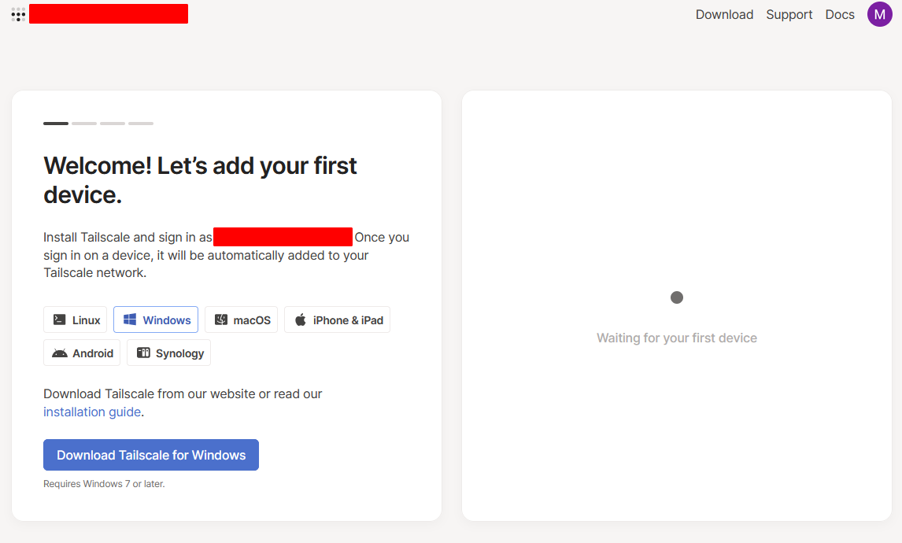
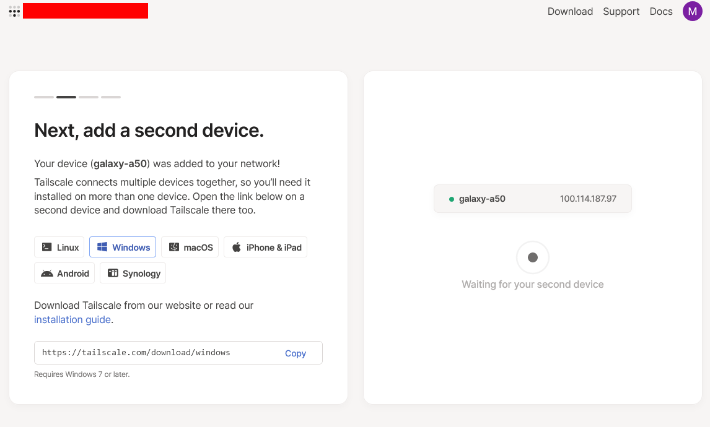
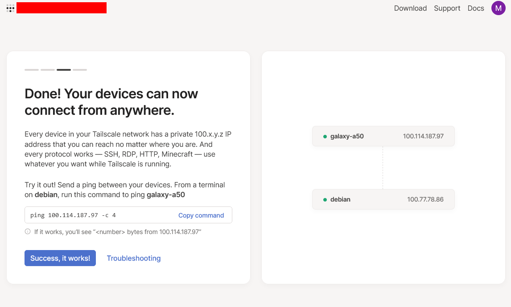
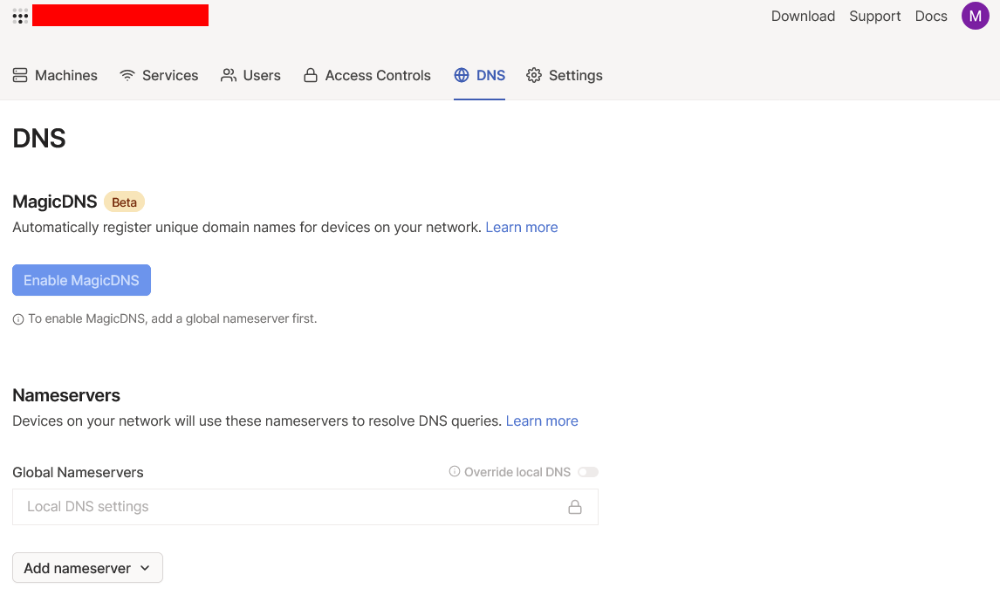
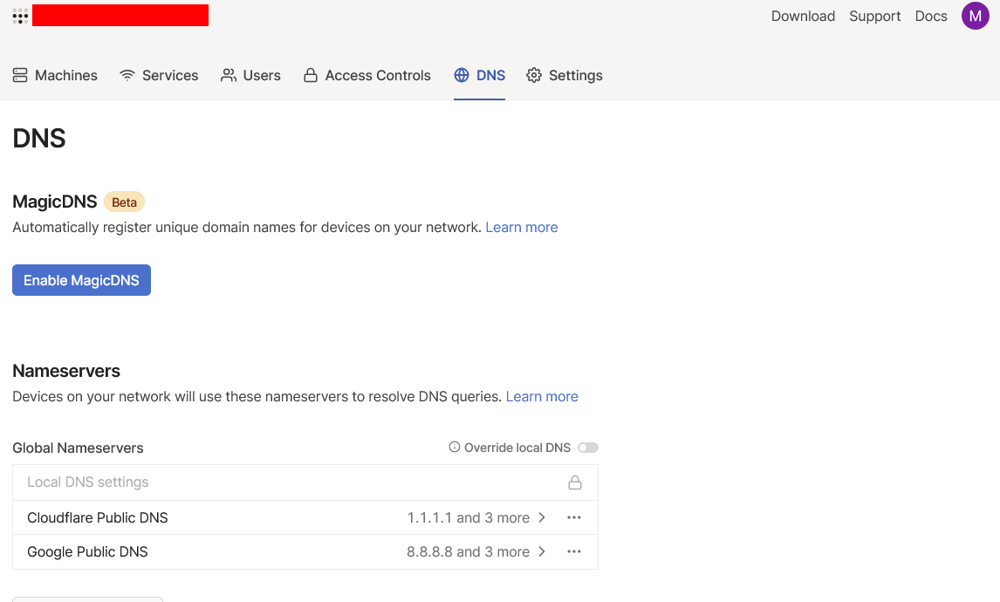
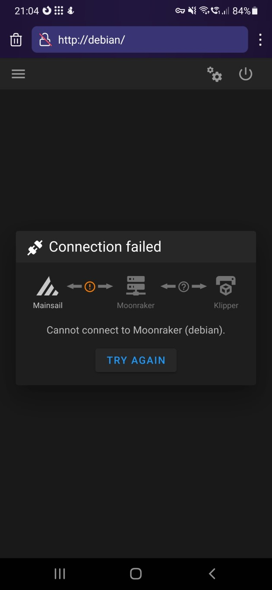
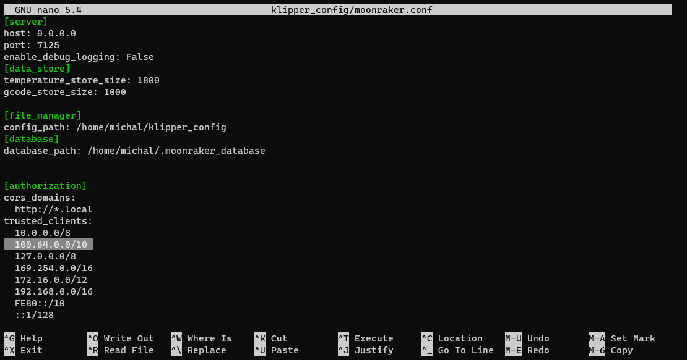
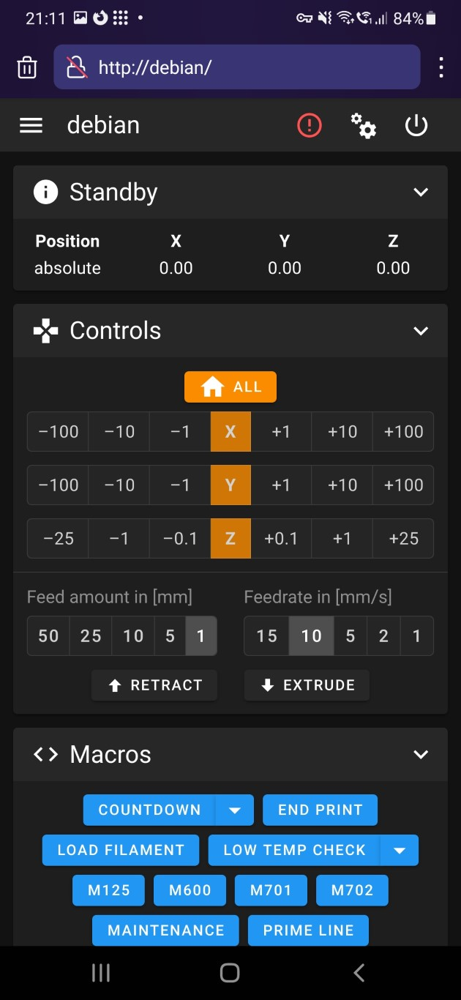

# Z czym to się je
Ponieważ często pada pytanie o to jak zrobić zdalny dostęp do drukarki a zawsze tylko odsyłaliśmy do dokumentacji to może przyda się opis.

Patentów na to jest dużo i na pewno najprostszym byłoby przekierowaie portów na routerze albo o zgrozo wrzucenie drukarki w DMZ ale jeśli takie pomysły nie budzą w was zgrozy to szczególny znak że lepiej tego nie robić.

Inną opcją nawet prostszą jeśli można mieć non stop włączony jakiś komputer albo ma się GUI na raspberry pi to rozwiązania typu teamviewer, zdalny pulpit chrome czy remote.it czy co tam jeszcze.

Natomiast jeśli chce się mieć bezpośredni dostęp do drukarki moją preferencją byłby jednak VPN i/lub sieć nakładkowa.

Moją propozycją jako najmiej upierdliwa jest Tailscale. Sieć nakładkowa, tworząca tunele Wireguarda między urządzeniami, które mogą nawiązać ze sobą łączność przez ich serwery, wtedy nie ma konieczności otwierania portów a i NAT przechodzi raczej bez problemów.

Wadą jest to że jednak jest to usługa oferowana przez firmę zewnętrzną, jeśli chce się mieć kontrolę nad całością infrastruktury od klientów po serwery mogę polecić analogicznie rozwiązanie Nebula, do której trzeba hostować własny serwer.
Nie zamierzam się skupiać na opisie tegoż.
# Co potrzeba
Musimy się zarejestrować w tailscale za pośrednictwem dowolnego obsługiwanego łącznika jak google, github, etc. lista [tu](https://tailscale.com/kb/1013/sso-providers/).

Oprócz tego oczywiście komputer drukarki czy pi czy cokolwiek używasz musi mieć dostęp do sieci.

Po zalogowaniu się zobaczymy taką witrynę:


Stamtąd możemy pobrać instalator klienta dla windowsa.
# Po stronie drukarki
Instalacja na linuksie może sprowadzić się do jednej komendy właściwie, mianowicie:
```sh
curl -fsSL https://tailscale.com/install.sh | sh
```
przy czym przed wrzucaniem skryptów z internetu bezpośrednio do sh oczywiście warto byłoby je przeczytać żeby wiedzieć co robią i czy na pewno to chcemy.
Purystów zapraszam [po instrukcje do odpowiedniego systemu (Rpi są pod debianem wylistowane)](https://tailscale.com/kb/1031/install-linux/).
Skrypt doda do repozytoriów paczkę tailscale, zainstaluje ją, po czym poprosi o wykonanie polecenia ```sudo tailscale up``` aby się połączyć.

Po pomyślnym połączeniu z serwerami tailscale dostaniemy w terminalu informację zwrotną z linkiem który pozwoli nam połączyć to urządzenie do naszej nowo utworzonej sieci. Najwygodniej go skopiować i wkleić w przeglądarce w której właśnie utworzyliśmy konto i jesteśmy zalogowani.

Po otwarciu go powinniśmy zobaczyć taki ekran z nazwą urządzenia które właśnie podłączyliśmy (możemy ją potem dowolnie zmienić):


Ja akurat dodałem telefon jako pierwszy.
# Po stronie komputera / telefonu
Po stronie telefonu bądź komputera musimy również zainstalować aplikację tailscale [dla odpowiadającego nam systemu](https://tailscale.com/download/).

Następnie możemy się w niej zalogować tym samym pośrednikiem co przy tworzeniu konta.

Jeśli wszystko poszło ok zobaczymy oba nasze urządzenia, ich adresy, oraz krótką instrukcje po lewej jak sprawdzić czy mogą się ze sobą komunikować.


W tym momencie jeśli wpiszemy w pasek przeglądarki adres powiązany z naszą drukarką prawdopodobnie wyświetli nam się wybrany interfejs moonrakera z informacją, że nie może się połączyć, ale ponieważ zapamiętywanie adresu ip jest dość upierdliwe proponuję wykonać jeszcze jeden krok po drodze, a mianowicie dodać automatyczny DNS - pozwoli nam to połączyć się z drukarką po jej nazwie w sieci tailscale zamiast adresu IP.

# Ustawienie DNS w panelu administracyjnym

W witrynie tailscale wybieramy zakładkę DNS i przewijamy na dół do miejsca w którym widnieje opcja "Add Nameserver"



Z listy wybieramy jedną lub dwie opcje, moim domyślnym wyborem jest cloudflare, a jako poboczny wskazałem serwery google.
Możemy też dodać własny serwer DNS, na przykład Pi-Hole jeśli mamy, jeśli ktoś jest zainteresowany taką opcją to całkiem prawdopodobne że wie jak to zrobić więc pozwolę sobie nie tłumaczyć w tym opisie :) 



Po wybraniu serwerów możemy włączyć opcję MagicDNS która pozwoli nam łączyć się z urządzeniami po ich nazwie zamiast po adresie IP.

# Ustawienie dozwolonych źródeł połączeń w konfiguracji klippera/moonrakera

W tym momencie jeśli połączymy się z drukarką (możliwe że trzeba poprzedzić nazwę urządzenia poprzez http:// w przeciwnym wypadku większość przeglądarek zacznie wyszukiwanie takiego hasła) zobaczymy taki ekran: 
 

Dostęp do moonrakera mamy tylko z adresów wskazanych w konfigu, więc musimy edytować plik `moonraker.conf` 

Możemy to zrobić albo z poziomu Fluidda/Mainsaila, albo bezpośrednio otwierając plik w nano vi emacsie czy innym wybranym edytorze.
W sekcji `[authorization]` do listy `trusted_clients` musimy dodać zakres adresów `  100.64.0.0/10`, w takim zakresie będą się pojawiać urządzenia w sieci tailscale. Oczywiśice możemy dodać konkretnie adres urządzenia z którego będziemy się łączyć, a nie całej dostępnej puli adresów.

Powinno to wyglądać jak na załączonym obrazku 

# Gotowe

Teraz kiedy spróbujemy się połączyć z adresem http://[nazwa urządzenia w sieci tailscale] wszystko już powinno działać. 